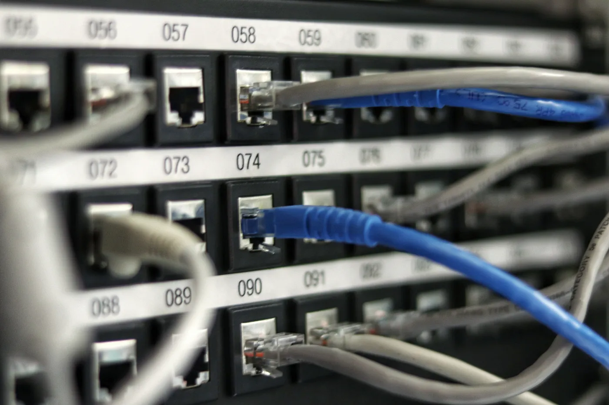

# Learning I2C: What is Clock Stretching?

_Ben Gillett &bull; Aug 2, 2021_

The Inter-Integrated Circuit bus protocol (more commonly known as I2C) is a popular and robust specification that 
describes how microcontrollers and other low-level hardware devices can communicate with each other on a circuit board. 
Laptops, phones, and even smart [light bulbs](https://www.sparkfun.com/products/8579) use it to communicate internally. 
It's sort of like the Ethernet of the microcontroller world.

_Not the best metaphor, but we'll roll with it  (Photo by 
[Jordan Harrison](https://unsplash.com/@jordanharrison?utm_source=medium&utm_medium=referral) on 
[Unsplash](https://unsplash.com/?utm_source=medium&utm_medium=referral))_

I2C is very well-documented: there's dozens of high-quality resources, explanations, and guides online! 
(I like [this writeup](https://www.analog.com/en/technical-articles/i2c-primer-what-is-i2c-part-1.html) 
from Analog Devices.) NXP maintains the [official spec](https://www.i2c-bus.org/specification/).

It's pretty simple to set up and use I2C in a project. 
The protocol uses just two wires (well, three if you don't already have a shared ground) 
and sends good old 1s and 0s. They map directly to data bytes: no complicated line codings are utilized. 
(You'll understand how confusing it gets if you've ever tried to 
[decode USB](https://www.engineersgarage.com/signal-and-encoding-of-usb-system-part-5-6/).) 
I2C makes use of a controller-responder hierarchy: the controller device requests data from a responder device, 
and then the responder sends it. (The terms "master" and "slave" are deprecated, but still not uncommon.) 
The actual messages are simple: the controller specifies an address and whether it's reading or writing data. 
Then the responder replies with the requested data. Short and sweet! 
You can have more than 100 responder devices on a single bus. 
("bus" referring to the proto-network you create by dropping lots of devices on a circuit board.)

_Why do they call it a bus, anyway? Wouldn't a train make more sense? 
(Photo by [CHUTTERSNAP](https://unsplash.com/@chuttersnap?utm_source=medium&utm_medium=referral) 
on [Unsplash](https://unsplash.com/?utm_source=medium&utm_medium=referral))_

I2C supports many different data speeds ("bitrates"). 
In normal operation, the controller device provides a simple clock signal on the (get ready for it) clock line. 
This heartbeat-like signal tells all the other devices on the bus how fast they can send data. 
This feature is especially useful when you have less powerful devices that need to talk more slowly: 
just switch to a slower speed! But what if you have a lot of fast devices and just one slow one? 
Or what if a device only sometimes needs extra time? 
It would be inconvenient to slow the whole bus down just for these circumstances.

Luckily, the designers of I2C foresaw this predicament and included another feature known as "Clock Stretching". 
As the name implies, the clock can be temporarily slowed down to accommodate temporary delays while still 
maintaining the higher bitrate in other situations. 
It involves a slight change of responsibility: the responder device manipulates the clock signal to ask for more time.

However, this extra complexity comes with a cost. I2C is intended to be an ultra-lightweight protocol. 
Some devices that use I2C don't even implement the whole protocol! (some FPGAs, for example) 
Supporting clock stretching necessitates a lot of extra logic for the controller device. 
The previously simple heartbeat signal is now complicated by a constant need to check the line and make 
sure the responder isn't holding it down and asking for more time. 
(Hardware folks will know that setting up a line for output and input can be very difficult.) 
And that's not all: some controller devices have bugs in their clock-stretching implementation! 
A very notable example of this is the BCM2835 [SoC](https://en.wikipedia.org/wiki/System_on_a_chip)
used on many Raspberry Pi models. 
The SoC sometimes misses requests to stretch the clock, rendering it nearly impossible to use that 
part of the I2C spec with this device. (It's interesting reading: 
[BCM2835 Datasheet Errata](https://elinux.org/BCM2835_datasheet_errata#p35_I2C_clock_stretching))

Clock Stretching is a great idea in premise. 
But sometimes, as in other tech domains, the added complexity outweighs the benefits. 
That's one reason it's relatively rare to see this feature used in the wild: 
often, design changes can eliminate the need to hold down the clock, or you can live with a lower bus bitrate.

Despite its relative simplicity (well, "simple" compared to some other hardware protocols...) 
I2C can get murky quickly. But I hope this summary leaves you with a better understanding of I2C 
and the clock stretching feature!

_`Raspberry Pi` `Engineering` `Hardware` `Software Engineering` `Arduino`_
