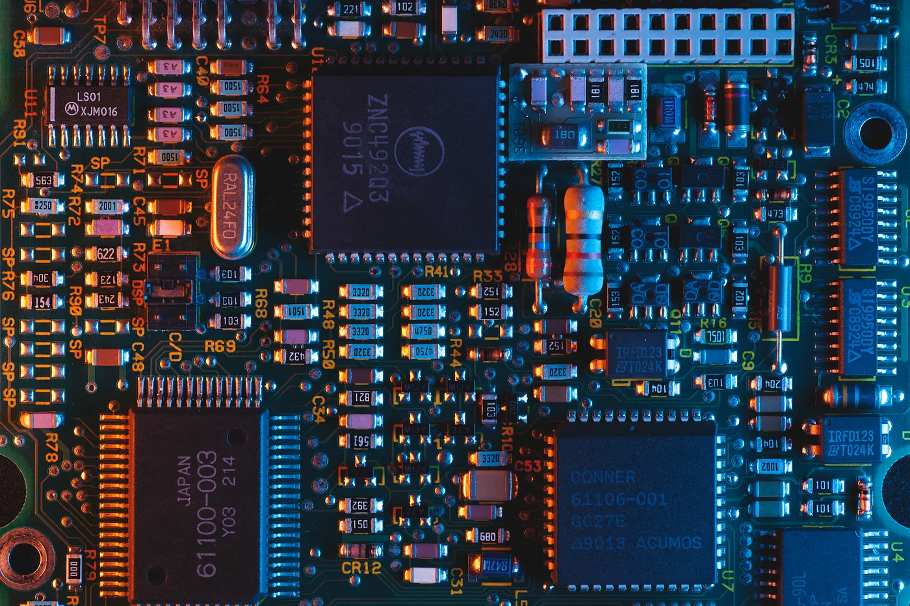
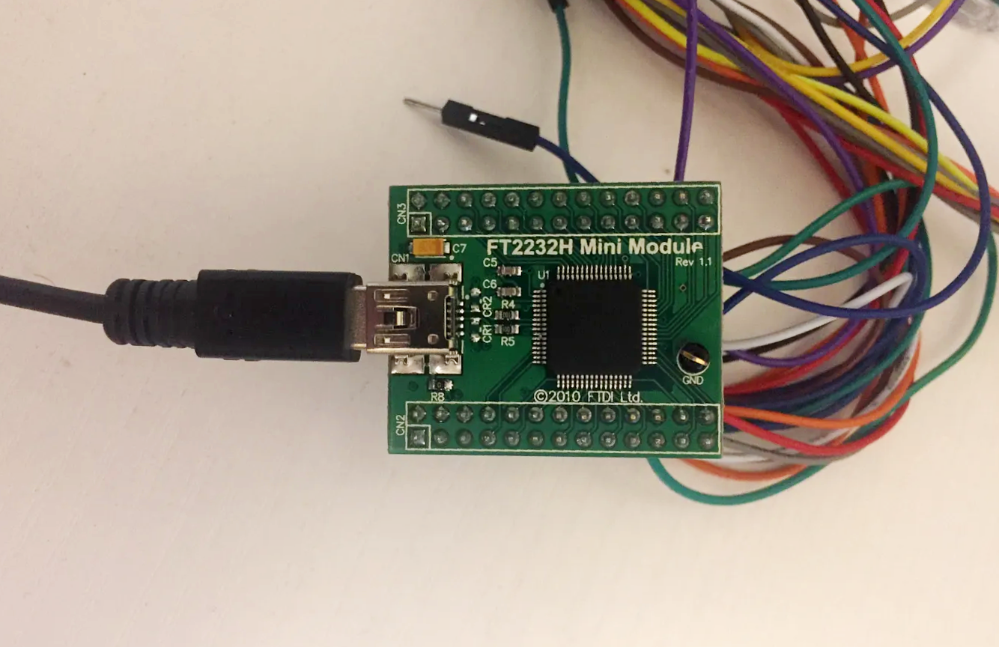

# I2C and more with the FTDI FT2232H Mini Module and an Arduino

_Ben Gillett &bull; Jun 28, 2020_

> _Interact with I2C, SPI, or bit-bang hardware using the FTDI FT2232H Mini module 
> in Python and test it with an Arduino!_

Sometimes you'll find yourself needing to bridge the gap between your PC and a low-level hardware device
like a microcontroller or an FPGA. These devices usually "speak" in protocols like I2C and SPI,
but you might even need to read and write bits (aka "bit-bang") in some situations.
Some ADC converters are configured via I2C, but the actual data is returned as sets of 8-bit words.

You might be tempted to deploy another microcontroller (like an Arduino) that has USB functionality built-in. 
This can be a great solution, but also increases your programming overhead.
You'd have to set up the wiring, program the microcontroller, select the pins and make sure they support 
the logic level and speeds you'll be interfacing at, and then package up the data and send it over serial, 
and then unpack it on the other end... it can quickly go from a 10-line quickie to an 
overdeveloped microcontroller nightmare.



_Photo by [Umberto](https://unsplash.com/@umby?utm_source=medium&utm_medium=referral) on [Unsplash](https://unsplash.com/?utm_source=medium&utm_medium=referral)_

Fortunately, there are other options for reading data straight from these low-level components. 
Enter [FTDI](https://www.ftdichip.com/): (Future Technology Devices International). 
This company offers several solutions for this exact issue (and many others, too). 
FTDI chip devices are found in almost all Arduino boards (either natively or as clones) 
and many other consumer devices as well. Their solution is simple: use a pre-programmed 
microcontroller and driver suite to manage all your hardware protocols at a high level. 
While not perfect for every situation, this approach can save you a lot of time, especially for smaller applications.

Let's look at how this might work: we'll use the [FT2232H Mini Module](https://www.digikey.com/product-detail/en/ftdi-future-technology-devices-international-ltd/FT2232H-MINI-MODULE/768-1030-ND) 
(available as a breakout — yay!) and simulate the low-level component with an Arduino. 
Of course, your hardware will typically be much nastier than an Arduino: no easily accessible USB IO, 
and maybe not even debug access. But we'll pretend for this example.
We'll start with some simple wiring. Our make-believe hardware component will have I2C IO as 
well as some bit-bang lanes for reading words directly. I'll use an Arduino Due, and make use of one of 
its hardware I2C buses and some digital pins in output mode. The FTDI module will be wired for I2C 
according to its [datasheet](https://www.ftdichip.com/Support/Documents/DataSheets/Modules/DS_FT2232H_Mini_Module.pdf), and we'll use some of its extra pins as digital inputs. 
The Arduino Due runs with 5V logic, and the FTDI chip has 3.3V logic but is 5V-tolerant, so this should work fine.

The datasheet describes how to wire the FTDI chip, but I've extracted the relevant info for you here. 
You'll want it in bus-powered mode (drawing power from USB). We'll need 3 wires for I2C: 
two for data (`SDA`) and one for the clock (`SCL`). The FTDI chip will act as the "primary" device on the bus. 
We can use either of the channels on the FT2232H for I2C, but I picked channel `B` — more on that soon. 
To power the FT2232H Mini Module and configure it for I2C, you can wire it as follows:

**Power**:

| FTDI                           | FTDI                                      |
|--------------------------------|-------------------------------------------|
| CN3–1                          | CN3–3                                     |
| _(any of)_ CN2–1, CN2–3, CN2–5 | _(all of)_ CN2–11, CN2–21, CN3–12, CN3–22 |

**I2C**:

| FTDI                | Arduino  |
|---------------------|----------|
| SDA: CN3–24, CN3–25 | SDA: D20 |
| SCA: CN3–26         | SCL: D21 |

Both of the I2C lines must be pulled high (3.3V via a 2K resistor or similar), 
but the Arduino has internal pull-ups on its I2C bus, so we don't need to worry about that in this example. 
It is also a good idea to run a grounding wire between the two devices as well.



_The FT2232H Mini Module_

For the digital logic lines, we'll use the AD bus on CN2. 
Wire up AD0–AD7 to some digital pins on the Arduino (on the Due, there's an abundance of these). 
In this example, I'll use Arduino pins 2–9. (wired as a mirror image for coding reasons...) 
Pulling from the FT2232H datasheet, our connections for the digital logic look like this:

| FTDI           | Arduino |
|----------------|---------|
| AD0 _(CN2–7)_  | Pin 9   |
| AD1 _(CN2–10)_ | Pin 8   |
| AD2 _(CN2–9)_  | Pin 7   |
| AD3 _(CN2–12)_ | Pin 6   |
| AD4 _(CN2–14)_ | Pin 5   |
| AD5 _(CN2–13)_ | Pin 4   |
| AD6 _(CN2–16)_ | Pin 3   |
| AD7 _(CN2–15)_ | Pin 2   |

With the wiring taken care of, we're ready to look at some code. 
In the Arduino world, we'll keep things simple: wait for a byte over I2C (as a "secondary" I2C device), 
and when we get one, send the same byte back over the digital lines by breaking up the byte into its bits 
and writing them to the pins.

```c++
// For Arduino Due
#include <Wire.h>

int pins[] = {2, 3, 4, 5, 6, 7, 8, 9};

void setup() {
  Serial.begin(9600);
  Serial.println("Testing...");
  // set the digital pins as outputs
  for (int i = 0; i < 8; i++) {
    pinMode(pins[i], OUTPUT);
  }
  Wire.begin(0x04); // join the I2C bus as a secondary device
  // with arbitrary address 0x04
  Wire.setClock(400000L); // 400kHz frequency
  Wire.onReceive(handleReceive); // set up a handler
}

void loop() {
  delay(10); // wait a few ms for the next interrupt
}

void handleReceive(int num) {
  byte b = 0;
  // Read all the bytes available, saving only the last one
  while (Wire.available() > 0) {
    b = Wire.read();
  }
  // BAD PRACTICE to have Serial println in an ISR...
  // but okay for demo ;)
  Serial.print("Got 0x");
  Serial.println(b, HEX);
  // Write the byte to the digital lines
  for (int i = 0; i < 8; i++) {
    digitalWrite(pins[i], b & 0b1); // set the i-th bit
    // shift the byte down so the next bit is always on the right
    b = b >> 1;
  }
}
```

As for the Python code, things are a bit more complex. 
FTDI drivers come in two flavors: `VCP` ("Virtual Com Port") and `D2XX`. 
VCP is the simpler way to do things: FTDI devices show up as serial port devices, 
and the OS exposes them as COM/TTY devices natively. This is the mode that Arduinos use (in most cases). 
However, to do more complicated things like I2C and bit-banging, we need the `D2XX` drivers.

The FTD2232H has two separate "channels", `A` and `B`, and they operate independently in separate modes (if desired). 
To do things like SPI and I2C, we need the channel to be in `MPSSE` ("Multi-Protocol Synchronous Serial Engine") mode. 
For bit-banging, we'll use a channel in `bit-bang` mode. 
For more information about modes in FTDI devices, check out the [FTDI D2XX Programming Guide](https://www.ftdichip.com/Support/Documents/ProgramGuides/D2XX_Programmer's_Guide(FT_000071).pdf). 
(Page 55, in particular) 
We'll put channel `B` in `MPSSE` mode for I2C, and channel `A` in bit-bang mode for the digital logic.

So, start by downloading the `D2XX` and `MPSSE` drivers. 
You can get them for your system at the FTDI website. 
There is an installer binary, but we just need the DLLs, so the zip will do fine. 
We'll also want the `MPSSE` driver DLL from here. Download these and dig out `ftd2xx.dll` and `libMPSSE.dll`
(or the equivalent `.a` library files for Linux/Mac).

We'll load these DLLs in Python using `ctypes`. 
It's always a good idea to check out a library's header files before writing code that uses it: 
`fdt2xx.h` and `libMPSSE_i2c.h` each contain lots of useful information 
(found in the download archive for their respective libraries). **Beware of the channel indices on the FT2232H!** 
On my device, channel `A` is index 1 and channel `B` is index 0... yikes! 
FTDI has several useful documents (called "application notes") describing how the FT2232 and other similar 
chips can be used. Have a look at 
[AN232R](https://www.ftdichip.com/Support/Documents/AppNotes/AN_232R-01_Bit_Bang_Mode_Available_For_FT232R_and_Ft245R.pdf) 
and [AN2232C](https://www.ftdichip.com/Support/Documents/AppNotes/AN2232C-02_FT2232CBitMode.pdf).

First, we'll make a few Python classes to make things a bit easier to handle. 
I've pulled some status codes and mode constants from the header files, as well as some structs 
representing `MPSSE` channels:

```python
import ctypes
from enum import Enum

class Channel():
    def __init__(self, name, index):
        self.name = name
        self.index = index
        self.handle = ctypes.c_void_p()

        
class ChannelConfig(ctypes.Structure):
    _fields_ = [('ClockRate', ctypes.c_int),
                ('LatencyTimer', ctypes.c_ubyte),
                ('Options', ctypes.c_int)]

    
class ChannelInfo(ctypes.Structure):
    _fields_ = [('Flags', ctypes.c_ulong),
                ('Type', ctypes.c_ulong),
                ('ID', ctypes.c_ulong),
                ('LocId', ctypes.c_ulong),
                ('SerialNumber', ctypes.c_char*16),
                ('Description', ctypes.c_char*64),
                ('ftHandle', ctypes.c_void_p)]
    
def __repr__(self):
        values = ', '.join(f'{name}={value}' for name, value in self._asdict().items())
        return f'<{self.__class__.__name__}: {values}>'
    
def _asdict(self):
        return {field[0]: getattr(self, field[0]) for field in self._fields_}
    
    
class FT_STATUS(Enum):
    FT_OK                             = 0
    FT_INVALID_HANDLE                 = 1
    FT_DEVICE_NOT_FOUND               = 2
    FT_DEVICE_NOT_OPENED              = 3
    FT_IO_ERROR                       = 4
    FT_INSUFFICIENT_RESOURCES         = 5
    FT_INVALID_PARAMETER              = 6
    FT_INVALID_BAUD_RATE              = 7
    FT_DEVICE_NOT_OPENED_FOR_ERASE    = 8
    FT_DEVICE_NOT_OPENED_FOR_WRITE    = 9
    FT_FAILED_TO_WRITE_DEVICE         = 10
    FT_EEPROM_READ_FAILED             = 11
    FT_EEPROM_WRITE_FAILED            = 12
    FT_EEPROM_ERASE_FAILED            = 13
    FT_EEPROM_NOT_PRESENT             = 14
    FT_EEPROM_NOT_PROGRAMMED          = 15
    FT_INVALID_ARGS                   = 16
    FT_NOT_SUPPORTED                  = 17
    FT_OTHER_ERROR                    = 18
    FT_DEVICE_LIST_NOT_READ           = 19
    
# Some constants for FTDI config...
START_BIT                   = 0x01
STOP_BIT                    = 0x02
BREAK_ON_NACK               = 0x04
NACK_LAST_BYTE              = 0x08
FAST_TRANSFER_BYTES         = 0x10
FAST_TRANSFER_BITS          = 0x20
FAST_TRANSFER               = 0x30
NO_ADDRESS                  = 0x40
I2C_DISABLE_3PHASE_CLOCKING = 0x01
I2C_ENABLE_DRIVE_ONLY_ZERO  = 0x02

def status(code):
    return FT_STATUS(code).name

```

That is a lot of boilerplate. But, it could easily be packed away in a module or set of classes to make life easier. 
We'll leave it as-is for this example. Next, we'll look at the code to do the fun stuff:

```python
# Load the libraries
libMPSSE = ctypes.cdll.LoadLibrary('./libMPSSE.dll')
print('Loaded MPSSE library')
libD2XX = ctypes.cdll.LoadLibrary('./ftd2xx.dll')
print('Loaded D2XX library')

# list the channels available
print('Listing channels...')
libMPSSE.Init_libMPSSE()
channel_count = ctypes.c_int()
ret = libMPSSE.I2C_GetNumChannels(ctypes.byref(channel_count))
print(f'Found {channel_count.value} channels (status {status(ret)})')

# Open Channel B (index 0) for I2C
c = Channel('B', 0)
write_address = 0x04
mode = START_BIT | STOP_BIT | NACK_LAST_BYTE
channel_info = ChannelInfo()
print(f'Getting info for channel with index {c.index}...')
ret = libMPSSE.I2C_GetChannelInfo(c.index, ctypes.byref(channel_info))
print(f'Channel description: {channel_info.Description.decode()} (status {status(ret)})')
ret = libMPSSE.I2C_OpenChannel(c.index, ctypes.byref(c.handle))
print(f'Channel {c.name} opened with handle: 0x{c.handle.value:x} (status {status(ret)})')
channel_conf = ChannelConfig(400000, 25, 0) # 400KHz, 25ms latency timer, no options
ret = libMPSSE.I2C_InitChannel(c.handle, ctypes.byref(channel_conf))
print(f'InitChannel() {c.name} (status {status(ret)})')

# Open Channel A (index 1) for bit-bang
handle = ctypes.c_void_p()
ret = libD2XX.FT_Open(1, ctypes.byref(handle))
print(f'FT_Open() (status {status(ret)})')
# 9600 * 16 = 153600 bytes/sec, see FTDI AN_232R-01
ret = libD2XX.FT_SetBaudRate(handle, 9600);
print(f'FT_SetBaudRate() (status {status(ret)})')
# set all pins as inputs, 0x1 is async bit-bang mode
ret = libD2XX.FT_SetBitMode(handle, 0b00000000, 0x1);
print(f'FT_SetBitMode() (status {status(ret)})')

# Send a byte (0x42) over I2C
buf = ctypes.create_string_buffer(b'', 1)
buf[0] = 0x42
bytes_transfered = ctypes.c_int()
ret = libMPSSE.I2C_DeviceWrite(c.handle, write_address, len(buf), buf, ctypes.byref(bytes_transfered), mode)
print(f'Wrote {bytes_transfered.value} byte(s) (status {status(ret)})')

# Read a byte from the bit-bang pins
b = ctypes.c_ubyte()
ret = libD2XX.FT_GetBitMode(handle, ctypes.byref(b))
print(f'FT_GetBitMode() (status {status(ret)})')
print(f'Byte read: 0x{b.value:x} (0b{b.value:>08b})') # hopefully it's 0x42

# Close the channels
ret = libMPSSE.I2C_CloseChannel(c.handle)
print(f'CloseChannel() {c.name} (status {status(ret)})')
ret = libD2XX.FT_Close(handle)
print(f'FT_Close() (status {status(ret)})')
```

Putting it all together, you should see the Python output looking like this:

```
$ python3 test.py
Loaded MPSSE library
Loaded D2XX library
Listing channels...
Found 2 channels (status FT_OK)
Getting info for channel with index 0...
Channel description: FT2232H MiniModule B (status FT_OK)
Channel B opened with handle: 0xfd9f58 (status FT_OK)
InitChannel() B (status FT_OK)
FT_Open() (status FT_OK)
FT_SetBaudRate() (status FT_OK)
FT_SetBitMode() (status FT_OK)
Wrote 1 byte(s) (status FT_OK)
FT_GetBitMode() (status FT_OK)
Byte read: 0x42 (0b01000010)
CloseChannel() B (status FT_OK)
FT_Close() (status FT_OK)
```

And on the Arduino serial console...
```
Testing...
Got 0x42
```

Cool! We sent a byte (0x42, in this case) via I2C to our "mystery hardware device" (the Arduino Due) 
and it sent back the same byte in parallel, using 8 digital pins.
This illustrates the usefulness and (relative) simplicity of using a FTDI device to interface with 
your low-level hardware instead of programming a microcontroller to do it for you.

-----

Hopefully you found this helpful! 
Integrating hardware with higher-level systems in languages like Python can get complicated and tedious in a hurry. 
But with a reasonable degree of organization, you can manage complex hardware devices easily with FTDI chips and 
their ready-to-go drivers.

_`Arduino` `FTDI` `I2C` `Hardware` `Python`_
